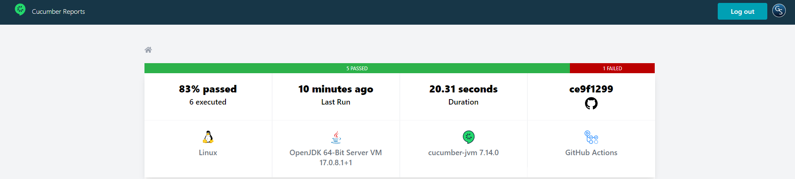

# Proyecto de ejemplo Selenide + Cucumber

Pruebas sobre la sandbox de automatizacion del sitio de Heroku

## Cómo probar localmente

Para probar este proyecto en tu entorno local, sigue estos pasos:

1. Clonar el repositorio a tu máquina local:

```bash
git clone https://github.com/Gsirota01/selenium-port.git
```
2. Instalar maven
    https://maven.apache.org/install.html

3. Ejecutar las pruebas de Selenium:
```bash
mvn clean test
```

4. Abrir el archivo de reporte en tu navegador
```
./reports/html-report.html
```

## Integración con Cucumber Reports
Si deseas ver este proyecto integrado con Cucumber Reports y Github Actions o tienes alguna pregunta sobre cómo usarlo en ese entorno, te dejo mi mail a continuacion:
Correo electrónico: gabisirota@gmail.com


